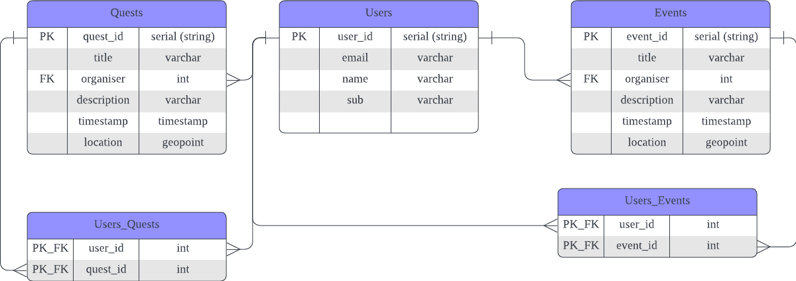

# RC Four

## Features

### Map

- 2d map of events/quests
    - events/quests will be shown as dots (coloured)
    - event/quests are accessed via eventService questService

#### What are quests?

> e.g. Need glue at 9pm at serangoon gardens. urgent! reward: 10c.

- gamified element where users set up quests for others to do
- rewards can come in the form of credits (on-platform) or off-platform self-settle

### Event & Quest Creation

- need some interface

#### Addon: fetch user events from google calendar

- figure out calendar integration

### Messaging

- users can dm each other
- somehow implemented through firebase RT database

## TODOs

<!-- - [ ] vibes -->

## Database

